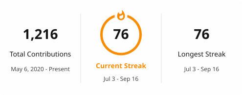

<div align="center">


# 𝓧𝓲𝓪𝓸𝓳𝓾

### 𝓘𝓷 𝓼𝓸𝓵𝓲𝓽𝓾𝓭𝓮, 𝔀𝓱𝓮𝓻𝓮 𝔀𝓮 𝓪𝓻𝓮 𝓵𝓮𝓪𝓼𝓽 𝓪𝓵𝓸𝓷𝓮.

##

<p align="center">
  <picture>
    <source
      media="(prefers-color-scheme: dark)"
      srcset="./profile/streak-dark.svg"
    />
    <source
      media="(prefers-color-scheme: light)"
      srcset="./profile/streak-light.svg"
    />
    
  </picture>
</p>
  
<p align="center">
   
  </p>
  


## Open Source Contributions

<!-- OSS_CONTRIBUTIONS:START -->

<p align="center">
  <a href="https://github.com/mem0ai/mem0/pull/5524"></a>
  <a href="https://github.com/ComposioHQ/composio/pull/3563"></a>
  <a href="https://github.com/assafelovic/gpt-researcher/pull/1802"></a>
</p>

| Status | Project | PR | Scope |
| --- | --- | --- | --- |
| Merged | `mem0ai/mem0` (63.1k stars) | [#5524](https://github.com/mem0ai/mem0/pull/5524) | Preserve empty Azure AI Search update values |
| Merged | `ComposioHQ/composio` (29.7k stars) | [#3563](https://github.com/ComposioHQ/composio/pull/3563) | Bound Python file transfer requests with timeouts |
| Merged | `assafelovic/gpt-researcher` (28.9k stars) | [#1802](https://github.com/assafelovic/gpt-researcher/pull/1802) | Keep oversized deep-research context from collapsing to empty |
| Merged | `Yuan1z0825/nature-skills` (34.9k stars) | [#68](https://github.com/Yuan1z0825/nature-skills/pull/68) | Add direct Claude Code plugin install path |
| Merged | `wanshuiyin/Auto-claude-code-research-in-sleep` (14.6k stars) | [#291](https://github.com/wanshuiyin/Auto-claude-code-research-in-sleep/pull/291) | Improve Codex MCP large payload handling |
| In review | `vllm-project/vllm` (88.9k stars) | [#45494](https://github.com/vllm-project/vllm/pull/45494) | Clarify NIXL KV transfer stats semantics |
| In review | `lobehub/lobehub` (81.6k stars) | [#15820](https://github.com/lobehub/lobehub/pull/15820) | Infer custom embedding model types |
| Closed | `Fission-AI/OpenSpec` (64.7k stars) | [#1186](https://github.com/Fission-AI/OpenSpec/pull/1186) | Support workspace planning homes and nested delta specs |

<!-- OSS_CONTRIBUTIONS:END -->

<!-- profile-refresh: oss-highlights-2026-06-28 -->
<!--START_SECTION:waka-->


**I'm a Night 🦉** 

```text
🌞 Morning                196 commits         ████░░░░░░░░░░░░░░░░░░░░░   16.33 % 
🌆 Daytime                317 commits         ███████░░░░░░░░░░░░░░░░░░   26.42 % 
🌃 Evening                474 commits         ██████████░░░░░░░░░░░░░░░   39.50 % 
🌙 Night                  213 commits         ████░░░░░░░░░░░░░░░░░░░░░   17.75 % 
```
📅 **I'm Most Productive on Thursday** 

```text
Monday                   135 commits         ███░░░░░░░░░░░░░░░░░░░░░░   11.25 % 
Tuesday                  194 commits         ████░░░░░░░░░░░░░░░░░░░░░   16.17 % 
Wednesday                207 commits         ████░░░░░░░░░░░░░░░░░░░░░   17.25 % 
Thursday                 259 commits         █████░░░░░░░░░░░░░░░░░░░░   21.58 % 
Friday                   157 commits         ███░░░░░░░░░░░░░░░░░░░░░░   13.08 % 
Saturday                 136 commits         ███░░░░░░░░░░░░░░░░░░░░░░   11.33 % 
Sunday                   112 commits         ██░░░░░░░░░░░░░░░░░░░░░░░   09.33 % 
```


📊 **This Week I Spent My Time On** 

```text
🕑︎ Time Zone: Asia/Shanghai

💬 Programming Languages: 
Markdown                 5 hrs 59 mins       ████████████████░░░░░░░░░   65.93 % 
Python                   1 hr 13 mins        ███░░░░░░░░░░░░░░░░░░░░░░   13.41 % 
Other                    41 mins             ██░░░░░░░░░░░░░░░░░░░░░░░   07.57 % 
YAML                     12 mins             █░░░░░░░░░░░░░░░░░░░░░░░░   02.21 % 
Rust                     11 mins             █░░░░░░░░░░░░░░░░░░░░░░░░   02.05 % 

🔥 Editors: 
VS Code                  7 hrs 23 mins       ████████████████████░░░░░   81.31 % 
Codex Vscode             1 hr 35 mins        ████░░░░░░░░░░░░░░░░░░░░░   17.55 % 
Claude Code              6 mins              ░░░░░░░░░░░░░░░░░░░░░░░░░   01.14 % 

💻 Operating System: 
Windows                  9 hrs 5 mins        █████████████████████████   100.00 % 
```

🤖 **AI Coding This Week** 

```text
⏱ AI Coding Time: 7 hrs 49 mins (86.1%)

✍️ 7,755 lines written by AI, 28 lines written by hand (99.64% AI-written)

🔤 18,142,338 Input Tokens, 667,852 Output Tokens

💵 $157.23 Estimated AI Cost This Week

🧠 22 AI Sessions, 35 AI Prompts

GPT                      7,818 lines         █████████████████████████   99.92 % 
Deepseek                 6 lines             ░░░░░░░░░░░░░░░░░░░░░░░░░   00.08 % 
Opus                     0 lines             ░░░░░░░░░░░░░░░░░░░░░░░░░   00.00 % 
Claude-Code              0 lines             ░░░░░░░░░░░░░░░░░░░░░░░░░   00.00 % 

🔎 AI Coding Insights:
🤖 AI-Driven — 99.64% of written lines came from AI
📚 Verbose Prompter — average 5,187 characters per prompt
🔁 Iterative Prompter — average 2 prompts per session
🚀 High AI Trust — 0.42% of changed lines were hand-edited
```


 Last Updated on 13/08/2026 01:57:12 UTC
<!--END_SECTION:waka-->


<div>

</div>

<table>
  <tr>
    <td></td>
    <td></td>
  </tr>
</table>

<!-- <p align="center"> -->
<!--    -->
<!-- </p> -->


**📈 GitHub Metrics**
<table>
  <tr>
    <td></td>
    <td></td>
  </tr>
  <tr>
    <td></td>
    <td></td>
  </tr>
  <tr>
    <td></td>
    <td></td>
  </tr>

</table>


<picture>
  <source media="(prefers-color-scheme: dark)" srcset="https://raw.githubusercontent.com/XiaojuCH/XiaojuCH/output/github-contribution-grid-snake-dark.svg">
  <source media="(prefers-color-scheme: light)" srcset="https://raw.githubusercontent.com/XiaojuCH/XiaojuCH/output/github-contribution-grid-snake.svg">
  
</picture>


<table>
  <tr>
    <td>
      <picture>
        <source media="(prefers-color-scheme: dark)" srcset="https://github-readme-activity-graph.vercel.app/graph?username=XiaojuCH&theme=xcode&bg_color=FF000000&hide_border=true" />
        <source media="(prefers-color-scheme: light)" srcset="https://github-readme-activity-graph.vercel.app/graph?username=XiaojuCH&theme=xcode&bg_color=FF000000&color=000000&hide_border=true" />
        
      </picture>
  </tr>
</table>

