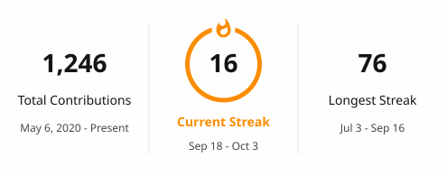

<div align="center">


# 𝓧𝓲𝓪𝓸𝓳𝓾

### 𝓘𝓷 𝓼𝓸𝓵𝓲𝓽𝓾𝓭𝓮, 𝔀𝓱𝓮𝓻𝓮 𝔀𝓮 𝓪𝓻𝓮 𝓵𝓮𝓪𝓼𝓽 𝓪𝓵𝓸𝓷𝓮.

##

<p align="center">
  <picture>
    <source
      media="(prefers-color-scheme: dark)"
      srcset="./profile/streak-dark.svg"
    />
    <source
      media="(prefers-color-scheme: light)"
      srcset="./profile/streak-light.svg"
    />
    
  </picture>
</p>
  
<p align="center">
   
  </p>
  


## Open Source Contributions

<!-- OSS_CONTRIBUTIONS:START -->

<p align="center">
  <a href="https://github.com/mem0ai/mem0/pull/5524"></a>
  <a href="https://github.com/ComposioHQ/composio/pull/3563"></a>
  <a href="https://github.com/assafelovic/gpt-researcher/pull/1802"></a>
</p>

| Status | Project | PR | Scope |
| --- | --- | --- | --- |
| Merged | `mem0ai/mem0` (66.9k stars) | [#5524](https://github.com/mem0ai/mem0/pull/5524) | Preserve empty Azure AI Search update values |
| Merged | `ComposioHQ/composio` (30.5k stars) | [#3563](https://github.com/ComposioHQ/composio/pull/3563) | Bound Python file transfer requests with timeouts |
| Merged | `assafelovic/gpt-researcher` (30.0k stars) | [#1802](https://github.com/assafelovic/gpt-researcher/pull/1802) | Keep oversized deep-research context from collapsing to empty |
| Merged | `Yuan1z0825/nature-skills` (46.9k stars) | [#68](https://github.com/Yuan1z0825/nature-skills/pull/68) | Add direct Claude Code plugin install path |
| Merged | `wanshuiyin/Auto-claude-code-research-in-sleep` (17.2k stars) | [#291](https://github.com/wanshuiyin/Auto-claude-code-research-in-sleep/pull/291) | Improve Codex MCP large payload handling |
| In review | `vllm-project/vllm` (93.5k stars) | [#45494](https://github.com/vllm-project/vllm/pull/45494) | Clarify NIXL KV transfer stats semantics |
| In review | `lobehub/lobehub` (83.1k stars) | [#15820](https://github.com/lobehub/lobehub/pull/15820) | Infer custom embedding model types |
| Closed | `Fission-AI/OpenSpec` (71.5k stars) | [#1186](https://github.com/Fission-AI/OpenSpec/pull/1186) | Support workspace planning homes and nested delta specs |

<!-- OSS_CONTRIBUTIONS:END -->

<!-- profile-refresh: oss-highlights-2026-06-28 -->
<!--START_SECTION:waka-->


**I'm a Night 🦉** 

```text
🌞 Morning                300 commits         ████░░░░░░░░░░░░░░░░░░░░░   15.25 % 
🌆 Daytime                549 commits         ███████░░░░░░░░░░░░░░░░░░   27.91 % 
🌃 Evening                766 commits         ██████████░░░░░░░░░░░░░░░   38.94 % 
🌙 Night                  352 commits         ████░░░░░░░░░░░░░░░░░░░░░   17.90 % 
```
📅 **I'm Most Productive on Thursday** 

```text
Monday                   247 commits         ███░░░░░░░░░░░░░░░░░░░░░░   12.56 % 
Tuesday                  365 commits         █████░░░░░░░░░░░░░░░░░░░░   18.56 % 
Wednesday                289 commits         ████░░░░░░░░░░░░░░░░░░░░░   14.69 % 
Thursday                 449 commits         ██████░░░░░░░░░░░░░░░░░░░   22.83 % 
Friday                   242 commits         ███░░░░░░░░░░░░░░░░░░░░░░   12.30 % 
Saturday                 207 commits         ███░░░░░░░░░░░░░░░░░░░░░░   10.52 % 
Sunday                   168 commits         ██░░░░░░░░░░░░░░░░░░░░░░░   08.54 % 
```


📊 **This Week I Spent My Time On** 

```text
💬 Programming Languages: 
Markdown                 6 hrs 14 mins       ██████████░░░░░░░░░░░░░░░   40.42 % 
Python                   5 hrs 36 mins       █████████░░░░░░░░░░░░░░░░   36.31 % 
JavaScript               49 mins             █░░░░░░░░░░░░░░░░░░░░░░░░   05.32 % 
YAML                     37 mins             █░░░░░░░░░░░░░░░░░░░░░░░░   04.01 % 
PHP                      36 mins             █░░░░░░░░░░░░░░░░░░░░░░░░   03.89 % 

🔥 Editors: 
Codex Vscode             14 hrs 6 mins       ███████████████████████░░   91.28 % 
VS Code                  1 hr 11 mins        ██░░░░░░░░░░░░░░░░░░░░░░░   07.75 % 
Antigravity Desktop      9 mins              ░░░░░░░░░░░░░░░░░░░░░░░░░   00.97 % 

💻 Operating System: 
Windows                  15 hrs 27 mins      █████████████████████████   100.00 % 
```


 Last Updated on 10/10/2026 04:27:44 UTC
<!--END_SECTION:waka-->


<div>

</div>

<table>
  <tr>
    <td></td>
    <td></td>
  </tr>
</table>

<!-- <p align="center"> -->
<!--    -->
<!-- </p> -->


**📈 GitHub Metrics**
<table>
  <tr>
    <td></td>
    <td></td>
  </tr>
  <tr>
    <td></td>
    <td></td>
  </tr>
  <tr>
    <td></td>
    <td></td>
  </tr>

</table>


<picture>
  <source media="(prefers-color-scheme: dark)" srcset="https://raw.githubusercontent.com/XiaojuCH/XiaojuCH/output/github-contribution-grid-snake-dark.svg">
  <source media="(prefers-color-scheme: light)" srcset="https://raw.githubusercontent.com/XiaojuCH/XiaojuCH/output/github-contribution-grid-snake.svg">
  
</picture>


<table>
  <tr>
    <td>
      <picture>
        <source media="(prefers-color-scheme: dark)" srcset="https://github-readme-activity-graph.vercel.app/graph?username=XiaojuCH&theme=xcode&bg_color=FF000000&hide_border=true" />
        <source media="(prefers-color-scheme: light)" srcset="https://github-readme-activity-graph.vercel.app/graph?username=XiaojuCH&theme=xcode&bg_color=FF000000&color=000000&hide_border=true" />
        
      </picture>
  </tr>
</table>

